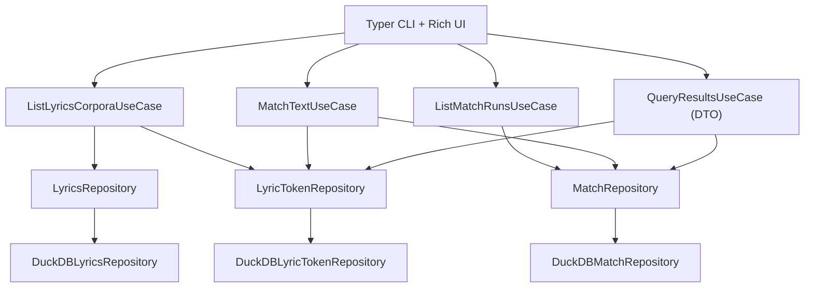

# Design Document

## Overview

本設計は、`lyric-talk` CLI のユーザービリティ改善を目的として、以下を実現する。

- `match` 実行時に `corpus_id` が省略された場合、コーパス一覧を提示して対話的に選択できる（Requirement 1）
- `query` 実行時に `run_id` が省略された場合、実行履歴一覧を提示して対話的に選択できる（Requirement 2）
- 一覧/参照/削除など CLI で必要になる読み取り系処理を、Interface 層に散らばらせず Application UseCase として整備する（Requirement 3）
- CLI 実装を **Typer + Rich** に刷新し、ヘルプ・入力バリデーション・一覧表示・対話選択の UX と型安全性を向上する（Requirement 4）
- UseCase 入出力を DTO で明確化し、`dict[str, Any]` ベースの曖昧さを排除する（Requirement 6）
- 既存の `match corpus_id` / `query run_id` 指定による利用は維持する（Requirement 5）

## Steering Document Alignment

### Technical Standards (tech.md)

- **DDD + Onion Architecture** の依存方向を維持する（Interface → Application → Domain、Infrastructure は Domain へ依存しない）。
- UseCase は Application 層に置き、CLI は「入力の解釈・対話・表示」に集中する。
- DTO は Application 層に置き、Domain モデル（`MatchRun`, `MatchResult`, `LyricsCorpus` 等）を CLI 表示に直接露出させない。
- 依存管理は `uv` を前提とし、テストは `pytest`、静的解析/整形は `ruff` に従う。

### Project Structure (structure.md)

- 追加/変更は既存の層構造に従う。
  - `src/application/use_cases/` に一覧/参照/削除系 UseCase を追加
  - `src/application/dtos/` に CLI 表示・入出力に必要な DTO を追加
  - `src/interface/cli/` に Typer + Rich ベースの CLI を実装（既存 `main.py` を置換/移行）
  - 必要なら `src/domain/repositories/` に一覧取得・件数取得などの抽象メソッドを追加し、`src/infrastructure/database/` の DuckDB 実装に反映

## Code Reuse Analysis

### Existing Components to Leverage

- **`RegisterLyricsUseCase` / `MatchTextUseCase` / `QueryResultsUseCase`**: コアユースケースは流用しつつ、一覧選択や DTO 化に合わせて拡張する。
- **Repository 実装**
  - `DuckDBLyricsRepository` / `DuckDBMatchRepository` / `DuckDBLyricTokenRepository`
  - 既存の `find_by_id` / `save` / `delete` を維持しつつ、一覧/サマリー取得向けのメソッドを追加する。
- **ドメインモデル**
  - `MatchResult` は `input_token` / `input_reading` / `match_type` / `matched_token_ids` / `mora_details` を既に保持しているため、説明可能な表示の土台として活用できる。

### Integration Points

- **Database/Storage**
  - `lyrics_corpus`, `lyric_tokens`, `match_runs`, `match_results` 既存スキーマを利用
  - 一覧表示のため、全件ロードを避けた「サマリー取得」を SQL で行えるよう repository API を設計する
- **CLI Entry Point**
  - `pyproject.toml` の entry point `lyric-talk = "src.interface.cli.main:main"` は維持し、`main()` 内部で Typer アプリを起動する

## Architecture

### High-level flow

- `match`:
  1) `corpus_id` が指定されていればそのまま `MatchTextUseCase.execute(input_text, corpus_id)`
  2) 省略されていれば `ListLyricsCorporaUseCase` で候補一覧 → 対話選択 → 1)へ

- `query`:
  1) `run_id` が指定されていれば `QueryResultsUseCase`（後述の DTO 版）で結果取得
  2) 省略されていれば `ListMatchRunsUseCase` で候補一覧 → 対話選択 → 1)へ

- 非対話環境（stdin が TTY でない等）の場合:
  - `corpus_id` / `run_id` 省略時に対話へフォールバックせず、明確なエラーと非ゼロ終了コードで終了する（Requirement 4-5, Reliability）

### Modular Design Principles

- **Single File Responsibility**
  - DTO 定義は `src/application/dtos/` に集約
  - UseCase は「取得/整形の責務」を持ち、CLI は表示に特化
- **Service Layer Separation**
  - Repository は「永続化・検索」のみ
  - UseCase は「ユースケース境界（一覧/参照/削除・整形DTO）」
  - CLI は「引数解釈、対話、表示、終了コード」

## Components and Interfaces

### Component 1: `ListLyricsCorporaUseCase`

- **Purpose:** コーパス一覧（CLI 表示に必要な概要）を取得する（Requirement 1, 3）
- **Interface:**
  - `execute(limit: int = 20) -> list[LyricsCorpusSummaryDto]`
- **Dependencies:** `LyricsRepository`, `LyricTokenRepository`
- **Reuses:** `LyricsCorpus`（メタデータ）

#### Repository 拡張（案）

- `LyricsRepository.list_lyric_corpuses(limit: int) -> list[LyricsCorpus]`
  - コーパスのメタデータを取得する。limit は作成日時降順での絞り込み
- `LyricTokenRepository.count_lyric_tokens_by_corpus_id(corpus_id: str) -> int`
- `LyricTokenRepository.list_lyric_tokens_by_corpus_id(corpus_id: str, limit_tokens: int) -> list[LyricToken]`

### Component 2: `ListMatchRunsUseCase`

- **Purpose:** 実行履歴一覧（CLI 表示に必要な概要）を取得する（Requirement 2, 3）
- **Interface:**
  - `execute(limit: int = 20) -> list[MatchRunSummaryDto]`
- **Dependencies:** `MatchRepository`

#### Repository 拡張（案）

- `MatchRepository.list_match_runs(limit: int) -> list[MatchRun]`
  - MatchResultも含める。limitは run_id ベースでの絞り込みをする
- `MatchRepository.count_match_results_by_run_id(run_id: str) -> int`

### Component 3: `QueryResultsUseCase`

- **Purpose:** `run_id` の結果を「判読可能な構造」で返す（Requirement 2, 6）
- **Interface:**
  - `execute(run_id: str) -> QueryResultsDto | None`

#### DTO 化のポイント

- 返り値を `dict` ではなく `QueryResultsDto`（pydantic）に置換する
- 表示に必要な「解決済み情報」を DTO に含める
  - 入力トークン（表層/読み）
  - `match_type`
  - 採用された歌詞トークン（表層/読み/lemma/pos 等、必要最小限）
  - `mora_combination` の根拠（`mora_details` をトレース可能に整形）
  - サマリー（再構成テキスト）

### Component 4: Typer + Rich CLI (`src/interface/cli/main.py`)

- **Purpose:** UX の高い CLI（help、型安全な引数、エラー表示、一覧、対話選択）を提供する（Requirement 4, 5）
- **Interfaces (commands):**
  - `lyric-talk register`（現状維持、help 改善）
  - `lyric-talk match [CORPUS_ID?] (--text/FILE)`
  - `lyric-talk query [RUN_ID?]`
  - 追加（設計で提供する）
    - `lyric-talk corpus list` / `lyric-talk run list`（非対話でも一覧取得可能にする）
    - `delete` 系は optional（Requirement 3-6）

#### 表示設計（Rich の活用）

- 一覧表示（コーパス一覧 / 実行履歴一覧）は `rich.table.Table` で表形式にする。
  - 長文（`input_text`）は DTO では省略せず保持しつつ、表のセル表示は折り返し/見切れ（Rich の overflow）を許容し、選択後の詳細表示で全文を提示する。
- マッチング結果の表示は `rich.tree.Tree` を基本にし、「入力トークン → マッチ種別 → 採用トークン/モーラ根拠」を階層で追えるようにする。

参考:

- Table: https://rich.readthedocs.io/en/latest/tables.html
- Tree: https://rich.readthedocs.io/en/latest/tree.html

#### 非対話対応

- `--corpus-id` / `--run-id` が未指定で、対話が必要なのに TTY でない場合は、
  - 「ID を指定して再実行する」または「list コマンドを使う」ガイダンスを表示して終了

## Data Models

### `LyricsCorpusSummaryDto`（Application DTO）

- `lyrics_corpus_id: str`
- `title: str | None`
- `artist: str | None`
- `created_at: datetime`
- `token_count: int`
- `preview_text: str`（先頭 N トークンの連結をサンプル表示として見せる）

### `MatchRunSummaryDto`（Application DTO）

- `run_id: str`
- `lyrics_corpus_id: str`
- `timestamp: datetime`
- `input_text: str`（全文）
- `results_count: int`

### `QueryResultsDto`（Application DTO）

- `match_run: MatchRunMetaDto`（run_id, corpus_id, timestamp, input_text, config）
- `items: list[QueryMatchItemDto]`
- `summary: QuerySummaryDto`

#### `QueryMatchItemDto` の要素（例）

- `input: InputTokenDto`（surface, reading）
- `match_type: MatchType`
- `chosen_lyrics_tokens: list[LyricTokenDto]`（surface, reading, lemma, pos, token_id など必要最小限）
- `mora_trace: MoraTraceDto | None`

#### `QuerySummaryDto`（例）

- `reconstructed_surface: str`（再構成文字列。EXACT系は採用トークン表層を連結。MORA系は「どの歌詞トークンのどのモーラを使ったか」が分かる表現を採用する）
- `reconstructed_reading: str`（再構成読み。EXACT系は採用トークン読み、MORA系は使用モーラ列を連結）
- `reconstruction_steps: list[ReconstructionStepDto]`（再構成の“手順”を入力トークン単位で保持し、どのように歌詞をつなげて `input_text` を再現したか追跡できる）
- `stats: MatchStatsDto`（match_type 別件数など）

#### 再構成（Reconstruction）の考え方

- `match_type` により「結合の単位」が異なる点を設計上明示する。
  - `exact_surface` / `exact_reading`: 一致している歌詞トークン（`matched_token_ids` で解決）をそのまま採用し、採用トークンの表層/読みを再構成に使う
  - `mora_combination`: 一致した“トークン”ではなく、`mora_details` に基づいて「採用されたモーラ列」を採用し、
    - どのモーラがどのトークン由来か（`source_token_id` + `mora_index`）
    - 採用モーラの連結結果（読み）
    が追えるようにする

`ReconstructionStepDto`（例）

- `input: InputTokenDto`（surface, reading）
- `match_type: MatchType`
- `chosen_surface: str | None`（EXACT系は採用トークン表層。MORA系は任意の説明文字列でもよい）
- `chosen_reading: str`（EXACT系は採用トークン読み、MORA系は採用モーラ列の連結）
- `chosen_lyrics_tokens: list[LyricTokenDto]`
- `mora_trace: MoraTraceDto | None`（MORA系のとき、採用モーラ列と source_token への対応を保持）

## Error Handling

### Error Scenarios

1. **コーパスが0件で match の corpus_id が省略された**
   - **Handling:** `ListLyricsCorporaUseCase` が空を返す → CLI が「先に register が必要」を Rich で表示
   - **User Impact:** 明確なメッセージ + 非ゼロ終了コード

2. **実行履歴が0件で query の run_id が省略された**
   - **Handling:** `ListMatchRunsUseCase` が空を返す → CLI が「先に match が必要」を表示
   - **User Impact:** 明確なメッセージ + 非ゼロ終了コード

3. **非対話環境で ID 省略が発生した**
   - **Handling:** 対話に入らず、`--corpus-id/--run-id` 指定や `list` コマンドの利用を促して終了
   - **User Impact:** ハングしない（CI 安全）

4. **存在しない corpus_id/run_id を指定した**
   - **Handling:** UseCase が `None` / NotFound を返す → CLI が「どの ID が不正か」「どう直すか」を表示
   - **User Impact:** ガイダンス付きエラー

## Testing Strategy

### Unit Testing

- Application:
  - `ListLyricsCorporaUseCase`（0/1/複数件、token_count/preview の生成）
  - `ListMatchRunsUseCase`（0/複数件、ソート、results_count）
  - `QueryResultsUseCase`（`exact_surface` / `exact_reading` / `mora_combination` を含む DTO 生成、サマリー生成）

### Integration Testing

- DuckDB 実装を使った「register → match → query」フロー
- 一覧 API（list_recent 等）の SQL がスキーマと整合していること

### End-to-End Testing

- Typer CLI のコマンド単位テスト（引数バリデーション、help、非対話でのエラー分岐）
- 対話選択は、可能なら Typer のテストユーティリティや stdin 差し替えで最小限を検証し、
  非対話エラー経路を重点的に担保する
