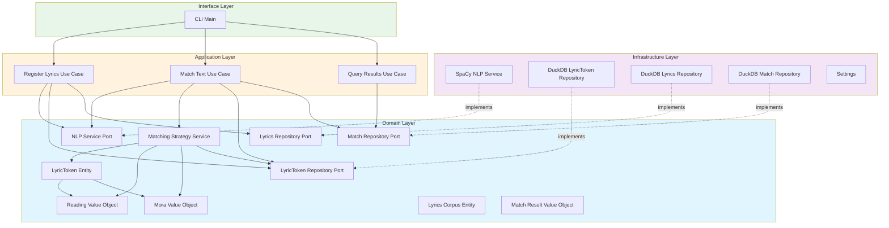

# 設計書（Design Document）- 修正版

## Overview

本設計は、`lyric-talk`（日本語歌詞を素材として入力文を"歌詞断片の組み合わせ"で再現するCLIツール）を **DDD（Domain-Driven Design） + Onion Architecture** に沿った構造へゼロベースで再構築するものです。

現状の実験的実装（`src/` 直下のフラットな構造）では、外部技術（spaCy/GiNZA、ファイルI/O、設定）とドメインロジック（モーラ分割、マッチング戦略）が密結合しており、拡張性とテスト容易性に課題があります。

本設計では、以下を実現します：

- **依存方向の逆転**: 内側（Domain/Application）は外側（Infrastructure/Interface）に依存しない
- **ドメインロジックの明示化**: 「読み」「モーラ」「マッチング戦略」などを純粋な値オブジェクト/エンティティとして定義
- **ユースケースの境界化**: 「歌詞登録」「入力文マッチング」「結果参照」を明確に分離
- **DB中心設計**: 歌詞コーパスと結果をDBに永続化し、Repository経由で検索（メモリ展開を避ける）
- **テスト容易性**: Port/Adapterパターンにより、外部依存（NLP、I/O、DB）を簡単にモック/スタブ化

### 設計の重要な変更点（フィードバック反映）

1. **歌詞コーパスをDBに永続化**: 歌詞全体をメモリに展開せず、DB検索を活用
2. **LyricsCorpusクラスを削除**: 代わりにRepository経由でLyricTokenを検索
3. **LyricTokenをEntity化**: 集約ルートとして扱い、`lyrics_corpus_id` で所属を管理
4. **Portを`domain/repositories/`に配置**: Onion原則に従い、Domain層にインターフェース定義
5. **pydanticを使用**: すべてのモデルで`pydantic.BaseModel`を使用（`@dataclass`は使わない）

## Alignment with Product Vision

本設計は `.spec-workflow/steering/product.md` の原則と目標に整合します：

**Product Principles への準拠**:

- **Explainability First**: 一致根拠（どの歌詞トークン/行から採ったか、モーラ内訳、マッチタイプ）を、DBリレーションとして保存し、後から追跡可能にする
- **Japanese-aware Matching**: 表層形・読み・モーラという日本語特有の手がかりを、ドメイン層の値オブジェクト（`Reading`, `Mora`）として明示的にモデリング
- **Reproducibility & Configurability**: 結果に影響する設定値（`max_mora_length`等）を実行メタデータ（`MatchRun.config`）として保存し、同一条件での再現性を担保

**Business Objectives への貢献**:

- テスト（pytest）と静的解析（ruff）を前提とした設計により、安心して改修できる開発体験を提供
- Repository経由のDB検索により、大規模コーパスやメモリ制約環境でもスケール可能
- DB永続化により、`product.md` の "Future Vision" で言及されている履歴管理・分析機能の土台を提供

## Steering Document Alignment

### Technical Standards (tech.md)

本設計は `.spec-workflow/steering/tech.md` の技術標準に準拠します：

- **Python 3.12+**: CPython ランタイム、依存管理は `uv`
- **テスト**: `pytest` + `pytest-cov` + `pytest-xdist` による並列テスト実行
- **Lint/Format**: `ruff` による高速なlint/format
- **NLP**: spaCy (>=3.7.0) + GiNZA (>=5.2.0, ja-ginza) による日本語形態素解析
- **設定管理**: `pydantic-settings` による環境変数/設定ファイル対応（環境変数接頭辞: `LYRIC_TALK_`）
- **パッケージング**: `hatchling` によるビルド、エントリポイント: `lyric-talk = "src.main:main"`
- **データモデル**: `pydantic` による型安全なモデル定義

**DDD + Onion Architecture への移行**:

`tech.md` で明示されているように、現状はPoC段階の実装であり、本設計により以下のレイヤ構造へ移行します：

- **Domain**: エンティティ/値オブジェクト/ドメインサービス（純粋なビジネスロジック）+ Repositoryインターフェース
- **Application**: ユースケース、入出力DTO
- **Infrastructure**: NLP/永続化等の外部技術実装（Repositoryの具象クラス）
- **Interface**: CLI（将来的にはAPI等）

**永続化の追加**:

`tech.md` では現状「メモリ上処理 + JSON出力」ですが、本設計ではDB永続化（DuckDB）を導入します。これは `product.md` の "Future Vision" で言及されている「履歴管理」機能の基盤となります。

### Project Structure (structure.md)

本設計は `.spec-workflow/steering/structure.md` で定義された「Planned (DDD + Onion Architecture)」の方針を具体化します。

**現状（PoC段階）**:

```
src/
├── main.py              # CLI エントリポイント
├── config.py            # 設定（pydantic-settings）
├── lyric_index.py       # 歌詞インデックス生成
├── matcher.py           # マッチングロジック
└── mora.py              # 読み正規化/モーラ分割
```

**本設計による新構造**（`structure.md` の Planned に準拠）:

```
src/
├── domain/                 # ドメイン層（外部依存なし）
│   ├── __init__.py
│   ├── models/            # エンティティ・値オブジェクト
│   │   ├── __init__.py
│   │   ├── lyric_token.py       # LyricToken エンティティ（集約ルート）
│   │   ├── reading.py     # Reading 値オブジェクト
│   │   ├── mora.py        # Mora 値オブジェクト
│   │   ├── lyrics_corpus.py  # LyricsCorpus エンティティ（メタデータのみ）
│   │   ├── match_result.py   # MatchResult 値オブジェクト
│   │   └── match_run.py      # MatchRun エンティティ
│   ├── repositories/      # リポジトリインターフェース（Port - Domain層に配置）
│   │   ├── __init__.py
│   │   ├── lyric_token_repository.py     # LyricToken検索・保存
│   │   ├── lyrics_repository.py    # 歌詞コーパスメタデータ管理
│   │   └── match_repository.py     # マッチング結果管理
│   └── services/          # ドメインサービス
│       ├── __init__.py
│       ├── nlp_service.py         # 形態素解析のPort（Domain層に配置）
│       └── matching_strategy.py   # マッチング戦略
│
├── application/           # アプリケーション層（ユースケース）
│   ├── __init__.py
│   ├── dtos/             # データ転送オブジェクト
│   │   ├── __init__.py
│   │   └── token_data.py         # NLP結果のDTO
│   └── use_cases/        # ユースケース
│       ├── __init__.py
│       ├── register_lyrics.py    # 歌詞をDBに登録
│       ├── match_text.py         # 入力文マッチング
│       └── query_results.py      # マッチング結果取得
│
├── infrastructure/        # インフラストラクチャ層（外部技術の実装）
│   ├── __init__.py
│   ├── nlp/
│   │   ├── __init__.py
│   │   └── spacy_nlp_service.py  # NlpServiceの実装
│   ├── database/
│   │   ├── __init__.py
│   │   ├── duckdb_lyric_token_repository.py    # LyricTokenRepositoryの実装
│   │   ├── duckdb_lyrics_repository.py   # LyricsRepositoryの実装
│   │   ├── duckdb_match_repository.py    # MatchRepositoryの実装
│   │   └── schema.py                     # テーブル定義
│   └── config/
│       ├── __init__.py
│       └── settings.py           # pydantic-settingsによる設定
│
└── interface/             # インターフェース層（CLI、将来的にはAPIなど）
    ├── __init__.py
    └── cli/
        ├── __init__.py
        └── main.py               # CLIエントリーポイント

tests/
├── unit/
│   ├── domain/          # ドメインモデル・サービスのテスト
│   ├── application/     # ユースケースのテスト（Port/Adapterをモック）
│   ├── infrastructure/  # 個別アダプタのテスト（spaCy、DuckDB等）
│   └── interface/       # CLIのテスト
├── integration/         # 統合テスト
└── fixtures/           # テスト用データ
```

## Code Reuse Analysis

### 既存コンポーネントの活用

現行実装は実験的コードのため、**ゼロベースで再構築**します。ただし、以下の知見・ロジックは再利用・参考にします：

- **モーラ分割ロジック（`src/mora.py`）**:
  - `split_mora()` 関数のロジックは、`domain/models/mora.py` の値オブジェクトに移植
  - 正規表現パターン（拗音・促音・長音の処理）をそのまま活用
  - `normalize_reading()` も `domain/models/reading.py` に移植

- **マッチング優先度ポリシー（`src/matcher.py`）**:
  - 「表層形 → 読み → モーラ組み合わせ」の3段階マッチング戦略を、`domain/services/matching_strategy.py` に抽出
  - `MatchType` 列挙型（`EXACT_SURFACE`, `EXACT_READING`, `MORA_COMBINATION`, `NO_MATCH`）は、`domain/models/match_result.py` に移植

- **設定管理（`src/config.py`）**:
  - `pydantic-settings` を使った環境変数対応の仕組みは、`infrastructure/config/settings.py` にそのまま移植

### 削除される既存実装

- **`src/main.py`**: CLI エントリーポイントは `interface/cli/main.py` として再実装
- **`src/lyric_index.py`**: ドメイン層 + Repository層に分割再実装
- **`src/matcher.py`**: ドメイン層 + アプリケーション層に分割再実装
- **`src/mora.py`**: `domain/models/mora.py` と `domain/models/reading.py` に分割移植

### Integration Points

- **既存のNLP依存（spaCy + GiNZA）**: `infrastructure/nlp/spacy_nlp_service.py` でラップし、アプリケーション層からは `NlpService` Port経由で利用
- **既存のDB（DuckDB）**: `infrastructure/database/` 配下のRepository実装で永続化
- **既存のテストフレームワーク（pytest）**: `tests/unit/` 配下に新しいテスト構造を作成

## Architecture

### Onion Architecture の依存方向



### Modular Design Principles

- **Single File Responsibility**: 各ファイルは1つの責務（1つの値オブジェクト、1つのユースケース、1つのアダプタ）のみを持つ
- **Component Isolation**: ドメインモデルは外部技術から完全に隔離され、純粋なPython型（+ pydantic）のみで構成
- **Service Layer Separation**:
  - Domain Service（`matching_strategy.py`）: ドメインロジック（Repository経由でLyricToken検索）
  - Application Service（`use_cases/`）: ユースケース（外部依存の組み立て・調整）
  - Infrastructure Service（`infrastructure/`）: 外部技術の実装
- **DB-Centric Design**: メモリに全データを展開せず、Repository経由でDB検索を活用

### 依存性の逆転（Dependency Inversion）

Domain層は **Repository/Service インターフェース（Port）** を定義し、Infrastructure層がそれを実装します：

- **NlpService** (domain/services/nlp_service.py): 形態素解析・読み取得の抽象
  - `tokenize(text: str) -> List[TokenData]`: 文字列をトークン化
- **LyricTokenRepository** (domain/repositories/lyric_token_repository.py): LyricToken検索・保存
  - `save_tokens(lyrics_corpus_id: str, tokens: List[LyricToken]) -> None`: LyricTokenを保存
  - `find_by_surface(lyrics_corpus_id: str, surface: str) -> List[LyricToken]`: 表層形で検索
  - `find_by_reading(lyrics_corpus_id: str, reading: str) -> List[LyricToken]`: 読みで検索
  - `find_by_mora(lyrics_corpus_id: str, mora: str) -> List[LyricToken]`: モーラで検索
  - `has_mora(lyrics_corpus_id: str, mora: str) -> bool`: モーラが含まれるかチェック
- **LyricsRepository** (domain/repositories/lyrics_repository.py): 歌詞コーパスメタデータ管理
  - `save_corpus(corpus: LyricsCorpus) -> str`: コーパスメタデータを保存し、IDを返す
  - `get_corpus(lyrics_corpus_id: str) -> LyricsCorpus`: コーパスメタデータを取得
  - `find_by_hash(content_hash: str) -> Optional[LyricsCorpus]`: 歌詞ハッシュで検索（重複回避）
- **MatchRepository** (domain/repositories/match_repository.py): マッチング結果管理
  - `save_match_run(run: MatchRun) -> str`: 実行メタデータを保存
  - `save_match_results(run_id: str, results: List[MatchResult]) -> None`: マッチング結果を保存
  - `get_match_run(run_id: str) -> MatchRun`: 実行メタデータを取得
  - `get_match_results(run_id: str) -> List[MatchResult]`: マッチング結果を取得

## Components and Interfaces

### Domain Layer

#### `domain/models/lyric_token.py` - LyricToken エンティティ（集約ルート）

- **Purpose:** 歌詞トークンを表すエンティティ（表層形・読み・基本形・品詞・モーラ・位置情報）
- **Interfaces:**
  - `LyricToken(lyrics_corpus_id, surface, reading, lemma, pos, line_index, token_index)`: コンストラクタ
  - `token_id: str`: ユニークID（プロパティ）
  - `moras: List[Mora]`: モーラのリスト（`Reading` から都度計算）
- **Dependencies:** `Reading`, `Mora`
- **Note**: pydantic BaseModelを使用

#### `domain/models/reading.py` - Reading 値オブジェクト

- **Purpose:** 読み（カタカナ）を表す値オブジェクト（正規化ロジックを含む）
- **Interfaces:**
  - `Reading(raw: str)`: コンストラクタ
  - `normalized: str`: 正規化された読み（カタカナ）
  - `to_moras() -> List[Mora]`: モーラに分割
- **Dependencies:** `Mora`
- **Note**: pydantic BaseModelを使用、immutable設定

#### `domain/models/mora.py` - Mora 値オブジェクト

- **Purpose:** モーラ（音節）を表す値オブジェクト
- **Interfaces:**
  - `Mora(value: str)`: コンストラクタ
  - `@staticmethod split(katakana: str) -> List[Mora]`: カタカナ文字列をモーラに分割
- **Dependencies:** なし
- **Note**: pydantic BaseModelを使用、immutable設定

#### `domain/models/lyrics_corpus.py` - LyricsCorpus エンティティ

- **Purpose:** 歌詞コーパスのメタデータを表すエンティティ（LyricTokenは含まない）
- **Interfaces:**
  - `LyricsCorpus(lyrics_corpus_id, content_hash, title, created_at)`: コンストラクタ
  - `lyrics_corpus_id: str`: ユニークID（UUID）
  - `content_hash: str`: 歌詞内容のハッシュ（重複検出用）
  - `title: Optional[str]`: 歌詞のタイトル（オプション）
- **Dependencies:** なし
- **Note**: LyricTokenの検索はRepository経由で行う（メモリ展開しない）

#### `domain/models/match_result.py` - MatchResult 値オブジェクト

- **Purpose:** マッチング結果を表す値オブジェクト
- **Interfaces:**
  - `MatchResult(input_token, input_reading, match_type, matched_token_ids, mora_details)`: コンストラクタ
  - `match_type: MatchType`: マッチタイプ（列挙型）
  - `matched_token_ids: List[str]`: マッチしたLyricTokenのID（リレーション）
- **Dependencies:** なし
- **Note**: pydantic BaseModelを使用

#### `domain/models/match_run.py` - MatchRun エンティティ

- **Purpose:** マッチング実行のメタデータを表すエンティティ
- **Interfaces:**
  - `MatchRun(run_id, lyrics_corpus_id, timestamp, input_text, config)`: コンストラクタ
  - `run_id: str`: ユニークID（UUID）
  - `lyrics_corpus_id: str`: 使用した歌詞コーパスのID
- **Dependencies:** なし
- **Note**: pydantic BaseModelを使用

#### `domain/services/matching_strategy.py` - MatchingStrategy ドメインサービス

- **Purpose:** マッチング戦略を実装するドメインサービス（優先度: 表層→読み→モーラ）
- **Interfaces:**
  - `MatchingStrategy(token_repo: LyricTokenRepository)`
  - `match_token(input_token_data: TokenData, lyrics_corpus_id: str, max_mora_length: int) -> MatchResult`: 1トークンをマッチング
- **Dependencies:** `LyricTokenRepository`, `LyricToken`, `Reading`, `Mora`, `MatchResult`
- **Note**: Repository経由でLyricTokenを検索（メモリ展開しない）

#### `domain/repositories/lyric_token_repository.py` - LyricTokenRepository Port

- **Purpose:** LyricToken検索・保存のRepositoryインターフェース（Domain層に配置）
- **Interfaces:**
  - `@abstractmethod save_tokens(lyrics_corpus_id: str, tokens: List[LyricToken]) -> None`
  - `@abstractmethod find_by_surface(lyrics_corpus_id: str, surface: str) -> List[LyricToken]`
  - `@abstractmethod find_by_reading(lyrics_corpus_id: str, reading: str) -> List[LyricToken]`
  - `@abstractmethod find_by_mora(lyrics_corpus_id: str, mora: str) -> List[LyricToken]`
  - `@abstractmethod has_mora(lyrics_corpus_id: str, mora: str) -> bool`
- **Dependencies:** `LyricToken`

#### `domain/repositories/lyrics_repository.py` - LyricsRepository Port

- **Purpose:** 歌詞コーパスメタデータ管理のRepositoryインターフェース（Domain層に配置）
- **Interfaces:**
  - `@abstractmethod save_corpus(corpus: LyricsCorpus) -> str`
  - `@abstractmethod get_corpus(lyrics_corpus_id: str) -> LyricsCorpus`
  - `@abstractmethod find_by_hash(content_hash: str) -> Optional[LyricsCorpus]`
- **Dependencies:** `LyricsCorpus`

#### `domain/repositories/match_repository.py` - MatchRepository Port

- **Purpose:** マッチング結果管理のRepositoryインターフェース（Domain層に配置）
- **Interfaces:**
  - `@abstractmethod save_match_run(run: MatchRun) -> str`
  - `@abstractmethod save_match_results(run_id: str, results: List[MatchResult]) -> None`
  - `@abstractmethod get_match_run(run_id: str) -> MatchRun`
  - `@abstractmethod get_match_results(run_id: str) -> List[MatchResult]`
- **Dependencies:** `MatchRun`, `MatchResult`

#### `domain/services/nlp_service.py` - NlpService Port

- **Purpose:** 形態素解析のインターフェース（Domain層に配置）
- **Interfaces:**
  - `@abstractmethod tokenize(text: str) -> List[TokenData]`
- **Dependencies:** なし（抽象）

### Application Layer

#### `application/dtos/token_data.py` - TokenData DTO

- **Purpose:** NLP結果を転送するDTO
- **Interfaces:**
  - `TokenData(surface, reading, lemma, pos, line_index, token_index)`: コンストラクタ
- **Dependencies:** なし
- **Note**: pydantic BaseModelを使用

#### `application/use_cases/register_lyrics.py` - RegisterLyricsUseCase

- **Purpose:** 歌詞をDBに登録するユースケース
- **Interfaces:**
  - `RegisterLyricsUseCase(nlp_service, token_repo, lyrics_repo)`
  - `execute(lyrics_text: str, title: Optional[str] = None) -> str`: 歌詞を登録し、lyrics_corpus_idを返す
- **Dependencies:** `NlpService`, `LyricTokenRepository`, `LyricsRepository`, `LyricsCorpus`, `LyricToken`
- **Note**: 同じ歌詞（ハッシュ）が既に登録されている場合は、既存IDを返す

#### `application/use_cases/match_text.py` - MatchTextUseCase

- **Purpose:** 入力文をマッチングするユースケース
- **Interfaces:**
  - `MatchTextUseCase(nlp_service, matching_strategy, match_repo)`
  - `execute(lyrics_corpus_id: str, input_text: str, max_mora_length: int = 5) -> str`: マッチングを実行し、run_idを返す
- **Dependencies:** `NlpService`, `MatchingStrategy`, `MatchRepository`, `MatchRun`, `MatchResult`

#### `application/use_cases/query_results.py` - QueryResultsUseCase

- **Purpose:** マッチング結果を取得するユースケース
- **Interfaces:**
  - `QueryResultsUseCase(match_repo, lyric_token_repo)`
  - `execute(run_id: str) -> Dict`: 実行メタデータ + 結果（LyricToken情報解決済み）を返す
- **Dependencies:** `MatchRepository`, `LyricTokenRepository`

### Infrastructure Layer

#### `infrastructure/nlp/spacy_nlp_service.py` - SpacyNlpService

- **Purpose:** spaCy + GiNZA を使った `NlpService` の実装
- **Interfaces:**
  - `SpacyNlpService(model_name: str = "ja_ginza")`
  - `tokenize(text: str) -> List[TokenData]`
- **Dependencies:** `spacy`, `NlpService`

#### `infrastructure/database/duckdb_lyric_token_repository.py` - DuckDBLyricTokenRepository

- **Purpose:** DuckDB を使った `LyricTokenRepository` の実装
- **Interfaces:**
  - `DuckDBLyricTokenRepository(db_path: str)`
  - `save_tokens(lyrics_corpus_id: str, tokens: List[LyricToken]) -> None`
  - `find_by_surface(lyrics_corpus_id: str, surface: str) -> List[LyricToken]`
  - `find_by_reading(lyrics_corpus_id: str, reading: str) -> List[LyricToken]`
  - `find_by_mora(lyrics_corpus_id: str, mora: str) -> List[LyricToken]`
  - `has_mora(lyrics_corpus_id: str, mora: str) -> bool`
- **Dependencies:** `duckdb`, `LyricTokenRepository`, `LyricToken`
- **Note**: SQL検索で実装（メモリ展開しない）

#### `infrastructure/database/duckdb_lyrics_repository.py` - DuckDBLyricsRepository

- **Purpose:** DuckDB を使った `LyricsRepository` の実装
- **Interfaces:**
  - `DuckDBLyricsRepository(db_path: str)`
  - `save_corpus(corpus: LyricsCorpus) -> str`
  - `get_corpus(lyrics_corpus_id: str) -> LyricsCorpus`
  - `find_by_hash(content_hash: str) -> Optional[LyricsCorpus]`
- **Dependencies:** `duckdb`, `LyricsRepository`, `LyricsCorpus`

#### `infrastructure/database/duckdb_match_repository.py` - DuckDBMatchRepository

- **Purpose:** DuckDB を使った `MatchRepository` の実装
- **Interfaces:**
  - `DuckDBMatchRepository(db_path: str)`
  - `save_match_run(run: MatchRun) -> str`
  - `save_match_results(run_id: str, results: List[MatchResult]) -> None`
  - `get_match_run(run_id: str) -> MatchRun`
  - `get_match_results(run_id: str) -> List[MatchResult]`
- **Dependencies:** `duckdb`, `MatchRepository`, `MatchRun`, `MatchResult`

#### `infrastructure/database/schema.py` - Database Schema

- **Purpose:** DuckDB テーブル定義（DDL）
- **Tables:**
  - `lyrics_corpus`: 歌詞コーパスメタデータ（lyrics_corpus_id, content_hash, title, created_at）
  - `lyric_tokens`: 歌詞トークン（token_id, lyrics_corpus_id, surface, reading, lemma, pos, line_index, token_index, moras_json）
  - `match_runs`: 実行メタデータ（run_id, lyrics_corpus_id, timestamp, input_text, config_json）
  - `match_results`: マッチング結果（result_id, run_id, input_token, input_reading, match_type, matched_token_ids_json, mora_details_json）
- **Indexes:**
  - `lyric_tokens`: `(lyrics_corpus_id, surface)`, `(lyrics_corpus_id, reading)`, `(lyrics_corpus_id, moras_json)` (JSON検索)
  - `lyrics_corpus`: `(content_hash)` (UNIQUE)

### Interface Layer

#### `interface/cli/main.py` - CLI Main

- **Purpose:** CLI エントリーポイント
- **Interfaces:**
  - `main() -> None`: `argparse` で引数を解析し、ユースケースを実行
- **Commands:**
  - `register`: 歌詞を登録
  - `match`: 入力文をマッチング
  - `query`: 結果を取得
- **Dependencies:** すべてのUseCase、Repository実装、NlpService実装、Settings

## Data Models

### Domain Models（pydantic BaseModel）

#### `LyricToken` - エンティティ

```python
from pydantic import BaseModel, Field, computed_field
from typing import List
from .reading import Reading
from .mora import Mora

class LyricToken(BaseModel):
    lyrics_corpus_id: str
    surface: str
    reading: Reading
    lemma: str
    pos: str
    line_index: int
    token_index: int
    
    class Config:
        frozen = False  # エンティティなのでmutable
    
    @computed_field
    @property
    def token_id(self) -> str:
        return f"{self.lyrics_corpus_id}_{self.line_index}_{self.token_index}"
    
    @computed_field
    @property
    def moras(self) -> List[Mora]:
        return self.reading.to_moras()
```

#### `Reading` - 値オブジェクト

```python
from pydantic import BaseModel, Field, computed_field
from typing import List

class Reading(BaseModel):
    raw: str
    
    class Config:
        frozen = True  # immutable
    
    @computed_field
    @property
    def normalized(self) -> str:
        # カタカナに正規化
        return normalize_to_katakana(self.raw)
    
    def to_moras(self) -> List["Mora"]:
        from .mora import Mora
        return Mora.split(self.normalized)
```

#### `Mora` - 値オブジェクト

```python
from pydantic import BaseModel
from typing import List
import re

class Mora(BaseModel):
    value: str
    
    class Config:
        frozen = True  # immutable
    
    @staticmethod
    def split(katakana: str) -> List["Mora"]:
        if not katakana:
            return []
        mora_pattern = re.compile(
            r"[ァ-ヴヵヶ][ャュョァィゥェォ]?ー?"
            r"|[ッンー]"
        )
        moras = mora_pattern.findall(katakana)
        return [Mora(value=m) for m in moras]
```

#### `LyricsCorpus` - エンティティ

```python
from pydantic import BaseModel
from datetime import datetime
from typing import Optional

class LyricsCorpus(BaseModel):
    lyrics_corpus_id: str  # UUID
    content_hash: str      # SHA256 of lyrics text
    title: Optional[str] = None
    created_at: datetime
    
    class Config:
        frozen = False  # エンティティなのでmutable
```

#### `MatchResult` - 値オブジェクト

```python
from pydantic import BaseModel
from typing import List, Optional
from enum import Enum

class MatchType(str, Enum):
    EXACT_SURFACE = "exact_surface"
    EXACT_READING = "exact_reading"
    MORA_COMBINATION = "mora_combination"
    NO_MATCH = "no_match"

class MoraMatchDetail(BaseModel):
    mora: str
    source_token_id: str
    mora_index: int
    
    class Config:
        frozen = True

class MatchResult(BaseModel):
    input_token: str
    input_reading: str
    match_type: MatchType
    matched_token_ids: List[str] = []
    mora_details: Optional[List[MoraMatchDetail]] = None
    
    class Config:
        frozen = True
```

#### `MatchRun` - エンティティ

```python
from pydantic import BaseModel
from datetime import datetime
from typing import Dict, Any

class MatchRun(BaseModel):
    run_id: str  # UUID
    lyrics_corpus_id: str
    timestamp: datetime
    input_text: str
    config: Dict[str, Any]  # {"max_mora_length": 5, ...}
    
    class Config:
        frozen = False  # エンティティなのでmutable
```

### Database Schema（DuckDB）

#### `lyrics_corpus` テーブル

```sql
CREATE TABLE IF NOT EXISTS lyrics_corpus (
    lyrics_corpus_id VARCHAR PRIMARY KEY,
    content_hash VARCHAR NOT NULL UNIQUE,
    title VARCHAR,
    created_at TIMESTAMP NOT NULL
);
```

#### `lyric_tokens` テーブル

```sql
CREATE TABLE IF NOT EXISTS lyric_tokens (
    token_id VARCHAR PRIMARY KEY,
    lyrics_corpus_id VARCHAR NOT NULL,
    surface VARCHAR NOT NULL,
    reading VARCHAR NOT NULL,
    lemma VARCHAR NOT NULL,
    pos VARCHAR NOT NULL,
    line_index INTEGER NOT NULL,
    token_index INTEGER NOT NULL,
    moras_json TEXT NOT NULL,  -- JSON array: ["ト", "ウ", "キョ", "ウ"]
    FOREIGN KEY (lyrics_corpus_id) REFERENCES lyrics_corpus(lyrics_corpus_id)
);

CREATE INDEX idx_lyric_tokens_corpus_surface ON lyric_tokens(lyrics_corpus_id, surface);
CREATE INDEX idx_lyric_tokens_corpus_reading ON lyric_tokens(lyrics_corpus_id, reading);
CREATE INDEX idx_lyric_tokens_corpus_id ON lyric_tokens(lyrics_corpus_id);
```

#### `match_runs` テーブル

```sql
CREATE TABLE IF NOT EXISTS match_runs (
    run_id VARCHAR PRIMARY KEY,
    lyrics_corpus_id VARCHAR NOT NULL,
    timestamp TIMESTAMP NOT NULL,
    input_text TEXT NOT NULL,
    config_json TEXT NOT NULL,
    FOREIGN KEY (lyrics_corpus_id) REFERENCES lyrics_corpus(lyrics_corpus_id)
);
```

#### `match_results` テーブル

```sql
CREATE TABLE IF NOT EXISTS match_results (
    result_id VARCHAR PRIMARY KEY,
    run_id VARCHAR NOT NULL,
    input_token VARCHAR NOT NULL,
    input_reading VARCHAR NOT NULL,
    match_type VARCHAR NOT NULL,
    matched_token_ids_json TEXT,
    mora_details_json TEXT,
    FOREIGN KEY (run_id) REFERENCES match_runs(run_id)
);

CREATE INDEX idx_match_results_run_id ON match_results(run_id);
```

## Error Handling

### Error Scenarios

#### Scenario 1: 歌詞ファイルが見つからない

- **Handling:** CLIがファイル存在確認、`FileNotFoundError` を送出
- **User Impact:** `"エラー: 歌詞ファイルが見つかりません: {path}"` を表示し、終了

#### Scenario 2: spaCyモデルがロードできない

- **Handling:** `SpacyNlpService.__init__()` が `OSError` を送出
- **User Impact:** `"エラー: spaCyモデルがロードできません。インストールしてください: python -m spacy download ja_ginza"` を表示し、終了

#### Scenario 3: DB保存時のエラー

- **Handling:** Repository実装が `duckdb.Error` を送出
- **User Impact:** `"エラー: DB操作に失敗しました: {error}"` を表示し、終了

#### Scenario 4: 存在しないlycrics_corpus_idを指定

- **Handling:** `LyricsRepository.get_corpus()` が `None` を返す、もしくは例外を送出
- **User Impact:** `"エラー: 指定された歌詞コーパスIDが見つかりません: {id}"` を表示し、終了

## Testing Strategy

### Unit Testing

#### Domain Layer（外部依存なし）

- **Models**: LyricToken, Reading, Mora, LyricsCorpus, MatchResult, MatchRun のプロパティ・メソッドをテスト
- **Services**: MatchingStrategy をモックRepository でテスト

#### Application Layer（Port/Adapterをモック化）

- **UseCases**: RegisterLyrics, MatchText, QueryResults をモックで実行

#### Infrastructure Layer（実際のDB/NLP）

- **Repositories**: 一時DBファイルでCRUD操作をテスト
- **NlpService**: 簡単なテキストで動作確認（`@pytest.mark.slow`）

### Integration Testing

- **Full Pipeline**: 実際のspaCy + DuckDBで、register → match → query の一連の流れをテスト（`@pytest.mark.integration`）

## Implementation Notes

### DB中心設計の利点

1. **スケーラビリティ**: 大規模コーパスでもメモリ使用量が一定
2. **再利用性**: 同じ歌詞を複数回登録せずに済む（ハッシュで重複検出）
3. **説明可能性**: マッチング結果から歌詞LyricToken情報をJOINで取得

### モーラ検索の実装

DuckDBでは、モーラ検索は以下の方法で実現：

- `moras_json` カラムに JSON配列を保存
- `json_contains()` 関数で部分一致検索

### CLI の新しいフロー

```bash
# 歌詞を登録
lyric-talk register --lyrics lyrics.txt --title "Song Title"
# => lyrics_corpus_id: abc123...

# マッチング実行
lyric-talk match --corpus-id abc123 --text "入力文章"
# => run_id: def456...

# 結果を参照
lyric-talk query --run-id def456
# => JSON出力（マッチング結果 + 歌詞LyricToken情報）
```

## Next Steps

本設計書の承認後、以下のタスク分解（`tasks.md`）を作成し、実装フェーズに移行します。
